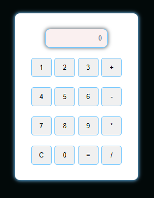

# Calculadora Web

## Descripción
Esta es una calculadora web sencilla desarrollada con HTML, CSS y JavaScript. Permite realizar operaciones matemáticas básicas como suma, resta, multiplicación y división.

## Tecnologías Utilizadas
- **HTML**: Estructura de la página web.
- **CSS**: Estilos para la interfaz de usuario.
- **JavaScript**: Lógica de funcionamiento de la calculadora.

## Características
- Interfaz amigable y responsive.
- Operaciones matemáticas básicas.
- Botones interactivos para ingresar números y operadores.

## Instalación y Uso
1. Descarga o clona este repositorio:
   ```bash
   git clone https://github.com/Migfive/Calculator-.git
   ```
2. Abre el archivo `index.html` en tu navegador web.
3. Utiliza los botones para realizar cálculos.

## Estructura del Proyecto
```
calculadora-web/
|-- index.html
|-- style.css
|-- script.js
|-- README.md
```

## Capturas de Pantalla

## Autor
Miguel Angel 
##

## Licencia
Este proyecto está bajo la licencia MIT. Puedes ver más detalles en el archivo `LICENSE`.

